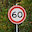
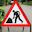

## Project: Build a Traffic Sign Recognition Program

# **Traffic Sign Recognition** 
---

**Build a Traffic Sign Recognition Project**

The goals / steps of this project are the following:
* Load the data set (see below for links to the project data set)
* Explore, summarize and visualize the data set
* Design, train and test a model architecture
* Use the model to make predictions on new images
* Analyze the softmax probabilities of the new images
* Summarize the results with a written report

### Data Set Summary & Exploration

I used the pandas library to calculate summary statistics of the traffic
signs data set:

* The size of training set is 34799
* The size of the validation set is 4410
* The size of test set is 12630
* The shape of a traffic sign image is 32x32x3
* The number of unique classes/labels in the data set is 43

#### 2. Exploratory visualization of the dataset.

Sample of the dataset is visualized in the IPython notebook. The data is clearly skewed. Some classes have way more training examples than others.  

### Design and Test a Model Architecture

#### 1. Preprocessing data. 

As a first step, I decided to convert the images to grayscale because I believe there is little information in color. In some cases however, the red or blue color can help make better predictions. We focus however on the grayscale.

As a last step, I normalized the image data because this will make the optimization process much faster. In may cases, this step is necessary for the convergence of the optimization algorithm.

#### 2.Model architecture.

My model is a slight variation of LeNet architecture. Some of the filters have different dimensions. The details are included in the following table:

| Layer         		|     Description	        					| 
|:---------------------:|:---------------------------------------------:| 
| Input         		| 32x32x1 (grayscale)   							| 
| Convolution 3x3     	| filter_hight = 5, filter_width = 5, in_depth = 6, out_depth = 20, stride = 1x1, padding = 'VALID' 	|
| tanh					|												|
| Max pooling	      	| filter_hight = 2, filter_width = 2, stride = 2x2, padding = 'VALID' 				|
| Convolution 3x3	    | filter_hight = 5, filter_width = 5, in_depth = 1, out_depth = 6, stride = 1x1, padding = 'VALID' |
| tanh					|												|
| Max pooling	      	| filter_hight = 2, filter_width = 2, stride = 2x2, padding = 'VALID' 				|
| flatten					|												|
| Fully connected		| input: 500x1, output: 200       									|
| tanh					|												|
| Fully connected		| input: 200x1, output: 100       									|
|	sigmoid					|												|
| Fully connected		| input: 100x1, output: 43       									|
 
The last layers is our logits, which are passed to a softmax layer. The softmax output is fed to a one-hot functions, which gives us our predictions.

#### 3. Training model.

| Variable         		|     Description	        					| 
|:---------------------:|:---------------------------------------------:| 
| Optimizer		| Adam       			|  
| Loss function		| Cross entropy       			|  
| Batch size		| 128      			|  
| Learning rate		|  0.0015       			|  
| Epochs		|  10       			|  
| Layer initialization		|  Truncated normals with mu = 0 and sigma = 0.1  			|  

#### 4. Results.

My final model results were:
* validation set accuracy of 0.954 
* test set accuracy of 0.931

If an iterative approach was chosen:
* I start off with the exact LeNet architecture with modified dimensions of the fully connected layers (see details of fully connected layers above). After varying the learning rate and batch size, the best validation accuracy was 0.89.
* Noticing that some classes of the dataset are under-represented, I removed dropout layers. The validation accuracy slightly to 0.91.
* I decided to try grayscale, to reduce the size of the network (in order to avoid overfitting). The accuracy slightly increases. So I decided to stick with grayscale.
* After varying the learning rate and batch size, the validation accuracy was still below 0.93. My initial impelentation of LeNet used sigmoid activation functions. I tried different activations such as tanh and relu to make sure that I don't have vanishing gradient problems. I found its best to use tanh activations, with the exception of the last one (set to signmoid).
* The results were satisfactory, i.e. slightly above 0.93 accuracy. 
* One more additional change inluded increasing the depth of the first two convolutional layers. This change increased the validation accruacy to 0.96.
 

### Test a Model on New Images

#### 1. Test on 5 random images from the web.

Here are five German traffic signs that I found on the web:

   
 

The first image might be difficult to classify because of the noise around the traffic sign (image not properly zoomed on the traffic sign).

#### 2. Predictions on web images.

Here are the results of the prediction:

| Image			        |     Prediction	        					|  Confidence           | Correct prediction among top 5? |
|:---------------------:|:-----------------------:|:--------------------------------:|:--------------------------------:| 
| 60_kmh      		| No passing   									| medium   									| Yes 									| 
| road_work     			| General caution    	| low   									| No  									|
| stop				| stop  											| high   									| Yes		|
| yield	      		| yield					 					| high   									| Yes  									|
| left_turn			| Slippery Road      								| low   									| Yes  									|

The exact probabilites are detailed in the IPython notebook.

The model was able to correctly guess 2 of the 5 traffic signs, which gives an accuracy of 40%. This does not compare well to the test accuracy. This was expected since many classes of our dataset have less than 500 images, which means there not enough training data that allows the network to generalize(dataset not rich enough). Also, the noise in these new images around the traffic signs is relatively higher than that in the training data. One way to help remove the effect of the noise is to include RGB layers in the training, rather than just grayscale (which is opposite to my initial intuition while designing the network. This will be added to future work).
